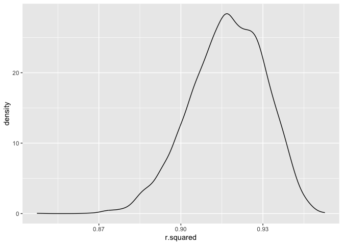
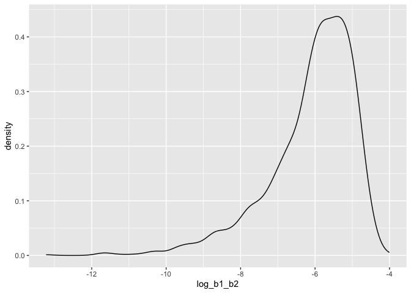
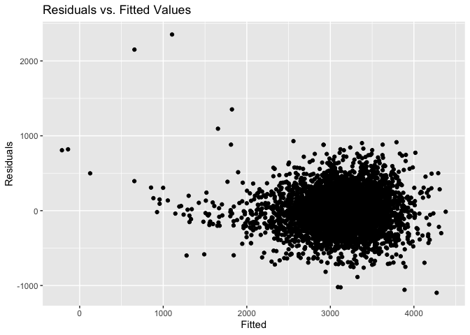
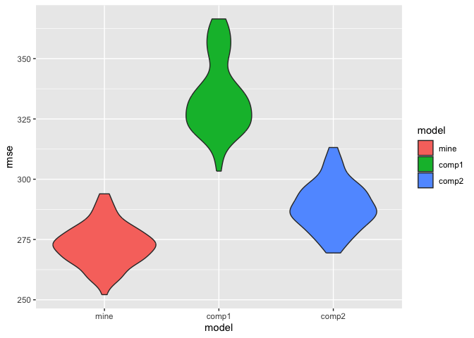

Hw6
================
Arthur Starodynov
2023-12-01

``` r
library(tidyverse)
library(rnoaa)
library(janitor)
library(MASS)
library(modelr)
set.seed(132)
```

# Problem 2

    The boostrap is helpful when you’d like to perform inference for a parameter / value / summary that doesn’t have an easy-to-write-down distribution in the usual repeated sampling framework. We’ll focus on a simple linear regression with tmax as the response with tmin and prcp as the predictors, and are interested in the distribution of two quantities estimated from these data:

    - r^2
    - log(b1*b2)

    Use 5000 bootstrap samples and, for each bootstrap sample, produce estimates of these two quantities. Plot the distribution of your estimates, and describe these in words. Using the 5000 bootstrap estimates, identify the 2.5% and 97.5% quantiles to provide a 95% confidence interval for r^2 and log(b1*b2).

Read in the data

``` r
# read data
weather_df = 
  rnoaa::meteo_pull_monitors(
    c("USW00094728"),
    var = c("PRCP", "TMIN", "TMAX"), 
    date_min = "2022-01-01",
    date_max = "2022-12-31") %>%
  mutate(
    name = recode(id, USW00094728 = "CentralPark_NY"),
    tmin = tmin / 10,
    tmax = tmax / 10) %>%
  dplyr::select(name, id, everything())
```

Next, I run the 5000 bootstrapped models and extract the elements of
interest.

``` r
# run the bootstraps
boot_df =
  weather_df %>%
  modelr::bootstrap(n = 5000) %>%
  mutate(
    models = map(strap, \(df) lm(tmax ~ tmin + prcp, data = df)),
    results = map(models, broom::tidy),
    rsquared = map(models, broom::glance)) %>%
  dplyr::select(results, rsquared) %>% unnest(rsquared) %>%
  dplyr::select(results, r.squared) %>% unnest(results) %>%
  dplyr::select(term, estimate, r.squared) 
```

Below, I plot the R^2 terms and calculate a CI for these values.

``` r
# R^2 plot
boot_df %>%
  filter(term == "(Intercept)") %>%
  ggplot(aes(x = r.squared)) +
  geom_density()
```

<!-- -->

``` r
# CI for R^2
r2_CI <-
  boot_df %>%
  filter(term == "(Intercept)") %>%
  dplyr::select(r.squared) %>%
  summarize(ci_lower = quantile(r.squared, 0.025), 
            ci_upper = quantile(r.squared, 0.975))

r2_CI
```

    ## # A tibble: 1 × 2
    ##   ci_lower ci_upper
    ##      <dbl>    <dbl>
    ## 1    0.888    0.940

The distribution of the 5000 R-squared values has a slight left skew and
is centered near .92. The 95% confidence interval of the R-squared
values is between: 0.8882964 and 0.9404107.

Below, I plot the estimates and calculate a confidence interval similar
to above.

``` r
# plot log(b1*b2)
boot_df %>%
  pivot_wider(names_from = term, values_from = estimate) %>% 
  rename(beta_1 = tmin, 
         beta_2 = prcp) %>% 
  mutate(log_b1_b2 = log(beta_1 * beta_2)) %>% 
  ggplot(aes(x = log_b1_b2)) + 
  geom_density()
```

<!-- -->

``` r
# CI for log(b1*b2)
log_b1b2_CI <-
boot_df %>%
  pivot_wider(names_from = term, values_from = estimate) %>% 
  rename(beta_1 = tmin, 
         beta_2 = prcp) %>% 
  mutate(log_b1_b2 = log(beta_1 * beta_2)) %>%
  summarize(NA_num = sum(is.na(log_b1_b2)),
            ci_lower = quantile(log_b1_b2, 0.025, na.rm = T), 
            ci_upper = quantile(log_b1_b2, 0.975, na.rm = T))

log_b1b2_CI
```

    ## # A tibble: 1 × 3
    ##   NA_num ci_lower ci_upper
    ##    <int>    <dbl>    <dbl>
    ## 1   3378    -9.09    -4.64

The distribution of the 5000 \*\*log(b1\*b2)\*\* values has a large left
skew. It’s peak is around -5. When we take the log of negative values,
NAs are produced.

# Problem 3

``` r
bw <- read_csv("./birthweight.csv") %>%
  janitor::clean_names() %>%
  mutate(
    babysex = as.factor(babysex),
    babysex = fct_recode(babysex, "male" = "1", "female" = "2"),
    frace = as.factor(frace),
    frace = fct_recode(frace, 
                       "white" = "1", "black" = "2", "asian" = "3", 
                       "puerto rican" = "4", "other" = "8"),
    malform = as.logical(malform),
    mrace = as.factor(mrace),
    mrace = fct_recode(mrace, "white" = "1", "black" = "2", 
                       "asian" = "3", "puerto rican" = "4")) %>%
  drop_na()
```

    Propose a regression model for birthweight. 

In order to choose model features, I will use a backward stepwise
selection algorithm from the MASS package. This uses AIC measure to kick
out predictors one by one in order to find the most parsimonious model.

``` r
lm1 <- lm(bwt ~., data = bw)
step <- stepAIC(lm1, direction = "backward", trace = FALSE)
step %>% broom::tidy() %>% knitr::kable()
```

| term              |      estimate |   std.error |  statistic |   p.value |
|:------------------|--------------:|------------:|-----------:|----------:|
| (Intercept)       | -6098.8219113 | 137.5463421 | -44.340124 | 0.0000000 |
| babysexfemale     |    28.5580171 |   8.4548958 |   3.377690 | 0.0007374 |
| bhead             |   130.7770408 |   3.4465672 |  37.944144 | 0.0000000 |
| blength           |    74.9471109 |   2.0190479 |  37.120027 | 0.0000000 |
| delwt             |     4.1067316 |   0.3920592 |  10.474775 | 0.0000000 |
| fincome           |     0.3180229 |   0.1747477 |   1.819898 | 0.0688436 |
| gaweeks           |    11.5924873 |   1.4620657 |   7.928842 | 0.0000000 |
| mheight           |     6.5940377 |   1.7848817 |   3.694383 | 0.0002231 |
| mraceblack        |  -138.7924801 |   9.9070869 | -14.009414 | 0.0000000 |
| mraceasian        |   -74.8867755 |  42.3146313 |  -1.769761 | 0.0768374 |
| mracepuerto rican |  -100.6781427 |  19.3246910 |  -5.209819 | 0.0000002 |
| parity            |    96.3046933 |  40.3362158 |   2.387549 | 0.0170038 |
| ppwt              |    -2.6755853 |   0.4273585 |  -6.260752 | 0.0000000 |
| smoken            |    -4.8434197 |   0.5855757 |  -8.271210 | 0.0000000 |

Here is a residual plot for my model (residuals vs. fitted values):

``` r
bw %>%  
  add_predictions(step) %>% 
  add_residuals(step) %>% 
  ggplot(aes(x = pred, y = resid)) + 
  geom_point() +
  labs(title = "Residuals vs. Fitted Values ", 
       x = "Fitted",
       y = "Residuals")
```

<!-- -->

    Compare your model to two others:

    - One using length at birth and gestational age as predictors (main effects only)
    - One using head circumference, length, sex, and all interactions (including the three-way interaction) between these

    Make this comparison in terms of the cross-validated prediction error; use crossv_mc and functions in purrr as appropriate.

Initialize Comparison Models:

``` r
lm2 <- lm(bwt ~ blength + gaweeks, data = bw)
lm2 %>% broom::tidy() %>% knitr::kable()
```

| term        |    estimate | std.error | statistic | p.value |
|:------------|------------:|----------:|----------:|--------:|
| (Intercept) | -4347.66707 | 97.958360 | -44.38281 |       0 |
| blength     |   128.55569 |  1.989891 |  64.60439 |       0 |
| gaweeks     |    27.04673 |  1.717930 |  15.74379 |       0 |

``` r
lm3 <- lm(bwt ~ bhead*blength*babysex, data = bw)
lm3 %>% broom::tidy() %>% knitr::kable()
```

| term                        |      estimate |    std.error |  statistic |   p.value |
|:----------------------------|--------------:|-------------:|-----------:|----------:|
| (Intercept)                 | -7176.8170221 | 1264.8397394 | -5.6740920 | 0.0000000 |
| bhead                       |   181.7956350 |   38.0542051 |  4.7772811 | 0.0000018 |
| blength                     |   102.1269235 |   26.2118095 |  3.8962180 | 0.0000992 |
| babysexfemale               |  6374.8683508 | 1677.7669213 |  3.7996150 | 0.0001469 |
| bhead:blength               |    -0.5536096 |    0.7802092 | -0.7095656 | 0.4780117 |
| bhead:babysexfemale         |  -198.3931810 |   51.0916850 | -3.8830816 | 0.0001047 |
| blength:babysexfemale       |  -123.7728875 |   35.1185360 | -3.5244319 | 0.0004288 |
| bhead:blength:babysexfemale |     3.8780531 |    1.0566296 |  3.6702106 | 0.0002453 |

CV Prediction Error:

Numerically showing the RMSE for each model:

``` r
cv_df <-
  crossv_mc(bw, 100) %>% 
  mutate(
    train = map(train, as_tibble), 
    test = map(test, as_tibble))

cv_comp <-
cv_df %>% 
  mutate(
    mod_mine  = map(train, ~lm(bwt ~ babysex + bhead + blength + delwt + fincome + 
    gaweeks + mheight + mrace + parity + ppwt + smoken, data = .x)),
    mod2  = map(train, ~lm(bwt ~ gaweeks + blength, data = .x)),
    mod3  = map(train, ~lm(bwt ~ bhead*blength*babysex, data = .x))) %>% 
  mutate(
    rmse_mine = map2_dbl(mod_mine, test, ~rmse(model = .x, data = .y)),
    rmse_2  = map2_dbl(mod2, test, ~rmse(model = .x, data = .y)),
    rmse_3 = map2_dbl(mod3, test, ~rmse(model = .x, data = .y))) %>% 
  summarize(
    avg_rmse_mod_mine = mean(rmse_mine),
    avg_rmse_mod2 = mean(rmse_2),
    avg_rmse_mod3 = mean(rmse_3))

cv_comp
```

    ## # A tibble: 1 × 3
    ##   avg_rmse_mod_mine avg_rmse_mod2 avg_rmse_mod3
    ##               <dbl>         <dbl>         <dbl>
    ## 1              273.          334.          289.

Plotting RMSE for each model:

``` r
cv_df %>% 
  mutate(mod_mine  = map(train, ~lm(bwt ~ babysex + bhead + blength + delwt + 
                                      fincome + gaweeks + mheight + mrace + parity + 
                                      ppwt + smoken, data = .x)),
         mod_comp1  = map(train, ~lm(bwt ~ gaweeks + blength, data = .x)),
         mod_comp2  = map(train, ~lm(bwt ~ bhead*blength*babysex, data = .x))) %>% 
  mutate(rmse_mine = map2_dbl(mod_mine, test, ~rmse(model = .x, data = .y)),
         rmse_comp1  = map2_dbl(mod_comp1, test, ~rmse(model = .x, data = .y)),
         rmse_comp2 = map2_dbl(mod_comp2, test, ~rmse(model = .x, data = .y))) %>%
  dplyr::select(rmse_mine, rmse_comp1, rmse_comp2) %>%  
  pivot_longer(everything(),
               names_to = "model", 
               values_to = "rmse",
               names_prefix = "rmse_") %>% 
  mutate(model = fct_inorder(model)) %>% 
  ggplot(aes(x = model, y = rmse)) + 
  geom_violin(aes(fill = model))
```

<!-- -->

The average RMSE is lowest for my model (272.7302801)compared to the 2
models defined above, compared to 333.9266267 for the first comparison
model
